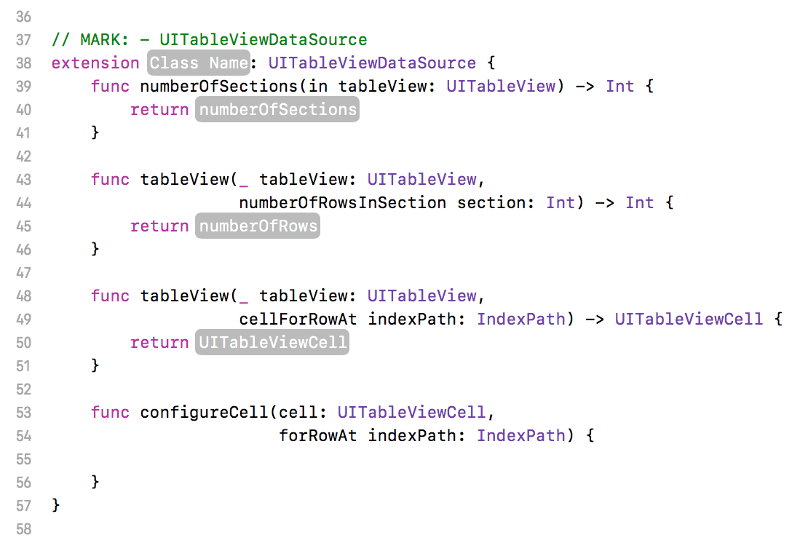

# Xcode Snippets
A collection of snippets to speed up development when using Xcode.

## Installation Instructions
Copy snippet files into `~/Library/Developer/Xcode/UserData/CodeSnippets/`

Whenever files are added or removed from this folder, we need to restart Xcode for them to take effect.

## Background
A little known feature of Xcode is the "Code Snippet Library" that allows you to reuse small chunks of code. As well as the built-in snippets, you can also create your own by dragging a highlighted code block into the library.

These snippets can also contain placeholders that can be tabbed through and filled in when used, as shown below:

## Usage
Code snippets are used by either dragging the snippet out of the Snippet Library, or using code completion when typing in the Xcode editor.

## Examples
Creating a delegate protocol:

Conform to `UITableViewDataSource` in an extension:

